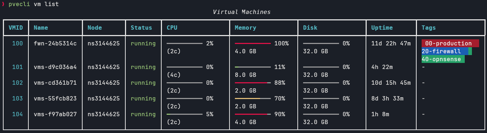

<div align="center">



**A modern, interactive CLI for managing Proxmox VE clusters**

[](https://www.python.org)
[](LICENSE.txt)
[](https://github.com/Helphyy/pvecli/releases)
[](https://www.proxmox.com)
[](https://pipx.pypa.io)

[Installation](#installation) · [Quick Start](#quick-start) · [Commands](docs/commands.md) · [Configuration](docs/configuration.md)

</div>

---

## Features

- 🎛 **Interactive menus** — Arrow-key navigation for VMs, containers, nodes, tags and storage
- 🎯 **Multi-target** — `pvecli vm stop 100,101,102` or pick several items from a menu
- 🌐 **Multi-cluster** — Switch between homelab and production with `--profile`
- 🖥 **Remote access** — Built-in VNC, SSH (with jump host), and RDP launchers
- 🎨 **Rich output** — Tables, spinners, colors, and confirmation prompts
- ⚡ **Async** — Fast parallel API calls via httpx

---

## Installation

Requires **Python 3.10+** and [pipx](https://pipx.pypa.io/).

```bash
pipx install git+https://github.com/Helphyy/pvecli.git
```

To upgrade:

```bash
pipx upgrade pvecli
```

---

## Quick Start

**1.** Create an API token in Proxmox: **Datacenter → Permissions → API Tokens → Add**

**2.** Configure pvecli:

```bash
pvecli config add
```

The interactive wizard asks for host, port, user, token name, and token value.

**3.** Test the connection:

```bash
pvecli config test
```

**4.** Start using it:

```bash
pvecli node list
pvecli vm list
pvecli ct list
```

> Every command works **interactively** when called without arguments — just navigate the menu with arrow keys.

---

## Command Groups

| Group | Description |
|:------|:------------|
| `pvecli config` | Manage cluster profiles (add, edit, remove, test, default…) |
| `pvecli node` | Node info, VNC shell, SSH |
| `pvecli vm` | Full VM lifecycle — start, stop, clone, snapshot, VNC, SSH, RDP… |
| `pvecli ct` | LXC container lifecycle |
| `pvecli storage` | Storage listing and content management (upload, delete…) |
| `pvecli pool` | Resource pool management |
| `pvecli cluster` | Cluster status, resources, and task log |
| `pvecli tag` | Global tag management with color palette |

→ **[Full command reference](docs/commands.md)**

---

## Examples

```bash
# Graceful shutdown across several VMs with a 2-minute timeout
pvecli vm shutdown 100,101,102 --timeout 120

# Snapshot before maintenance
pvecli vm snapshot add 100 pre-update --description "Before system update"

# SSH into a VM using the Proxmox node as a jump host
pvecli vm ssh 100 --jump

# Run a one-off command against the production cluster
pvecli vm list --profile production

# Tag containers for organization
pvecli ct tag add 200 web,production
```

---

## Shell Completion

```bash
pvecli --install-completion bash && source ~/.bashrc   # Bash
pvecli --install-completion zsh  && source ~/.zshrc    # Zsh
pvecli --install-completion fish                       # Fish
```

---

## Development

```bash
git clone https://github.com/Helphyy/pvecli.git
cd pvecli
python -m venv .venv && source .venv/bin/activate
pip install -e ".[dev]"
```

```bash
ruff format .     # Format
ruff check .      # Lint
mypy src/pvecli   # Type check
pytest            # Test
```

---

## Security

- Config stored at `~/.config/pvecli/config.yaml` with `600` permissions (owner-read only)
- API token auth recommended over password auth
- SSL verification enabled by default — use `verify_ssl: false` only for self-signed certificates

---

## License

MIT — see [LICENSE.txt](LICENSE.txt)
